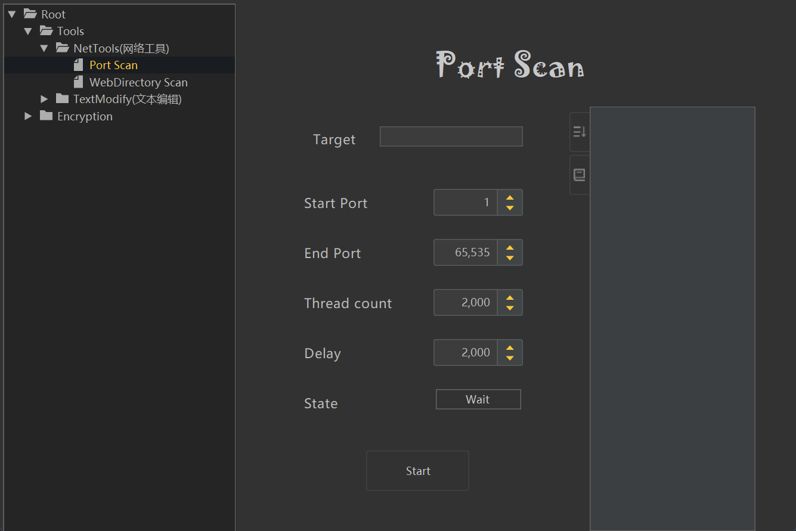
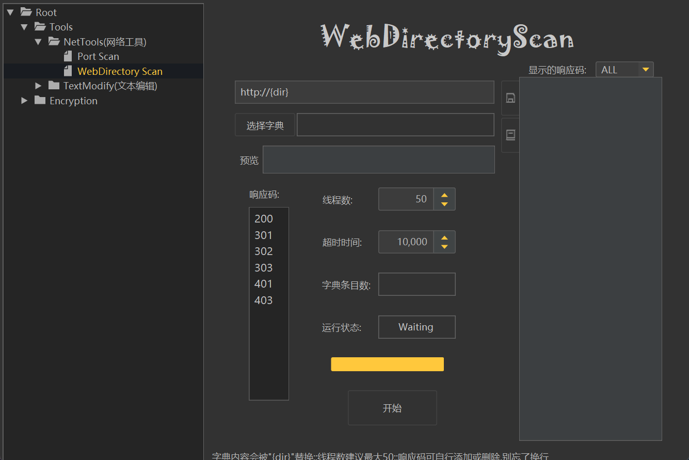
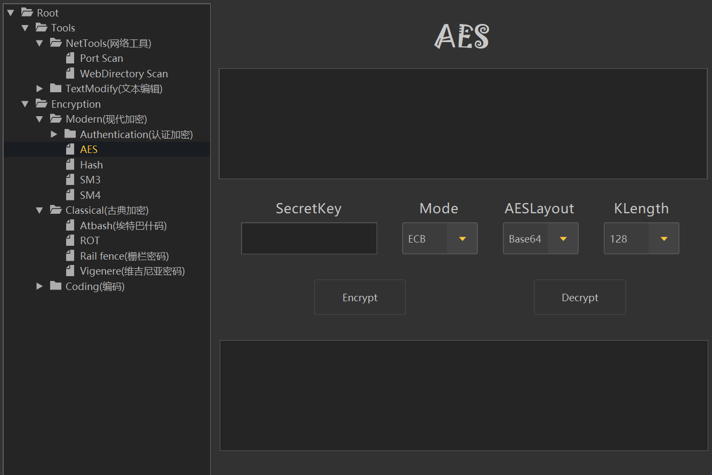
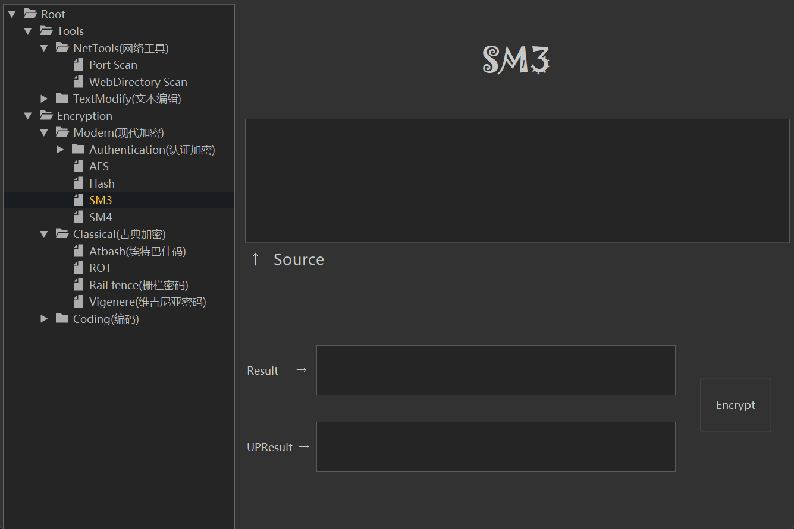
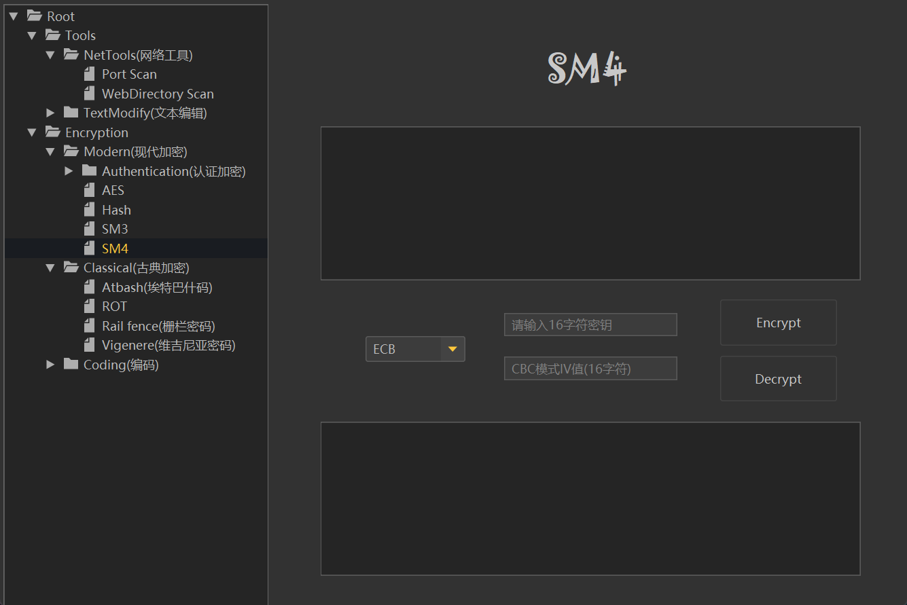
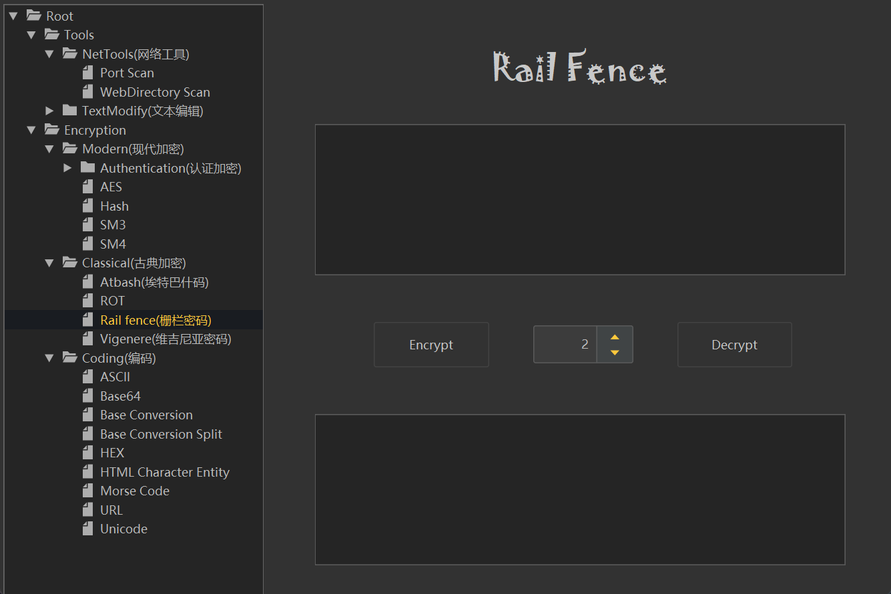
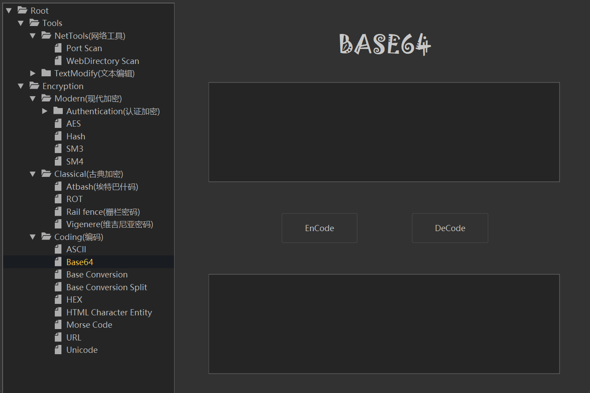
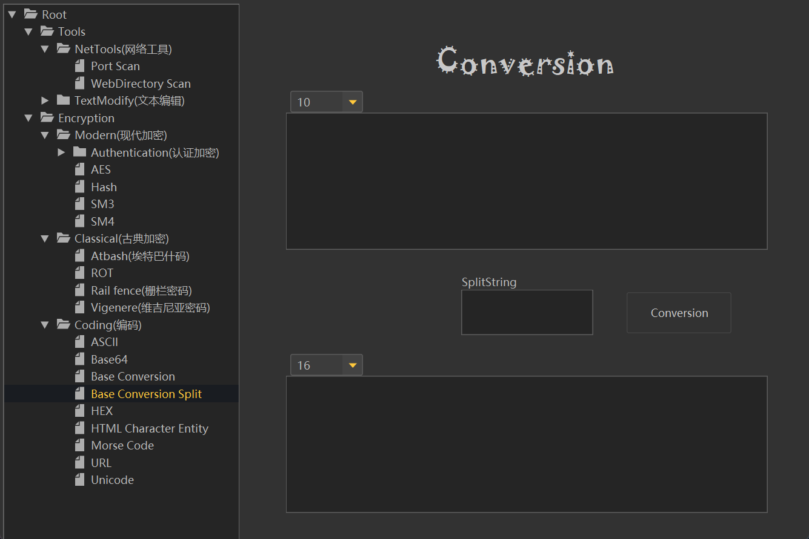
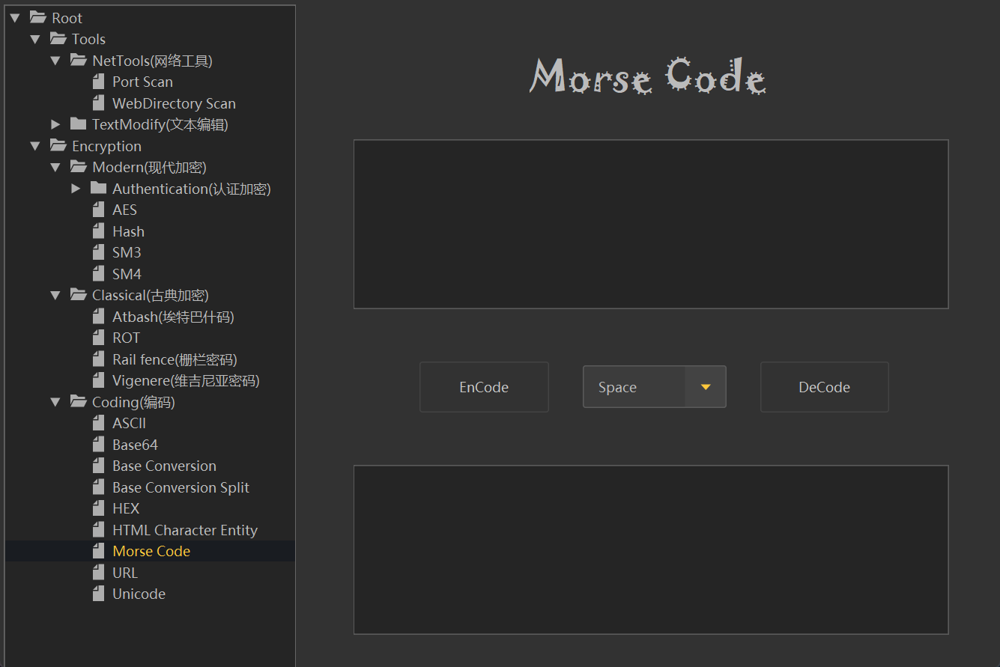

# CryptionTool 项目说明文档
# 源码获取：https://mbd.pub/o/bread/mbd-YZWZmZ1wZA==
## 一、项目概述

CryptionTool 是一个基于 Java 开发的信息安全 CTF 竞赛辅助系统，主要提供加解密、编解码、网络工具等功能。该系统旨在为 CTF 竞赛参与者和信息安全学习者提供便捷的工具集，帮助快速解决各类密码学和编码相关的挑战。

### 项目基本信息
- **项目名称**: CryptionTool
- **当前版本**: 2.13.1
- **开发语言**: Java 8
- **构建工具**: Maven
- **UI 框架**: FlatLaf

---

## 二、技术栈

### 核心技术
- **Java**: JDK 8 及以上版本
- **Maven**: 项目构建和依赖管理
- **FlatLaf**: 现代化的 Swing 外观主题框架

### 主要依赖库
- `flatlaf 0.33`: UI 主题框架
- `commons-httpclient 3.1`: HTTP 客户端工具
- `commons-text 1.3`: 文本处理工具
- `commons-lang3 3.7`: 通用工具类
- `commons-codec 1.2`: 编解码工具

---

## 三、功能特性

### 3.1 加解密/编解码工具

#### 现代加密算法
- **AES**: 高级加密标准（测试版）
- **DES**: 数据加密标准
- **SM3**: 国密哈希算法
- **SM4**: 国密分组密码算法

#### 哈希算法
- **MD5**: 消息摘要算法
- **MD5-16**: 16位 MD5
- **MD2**: 消息摘要算法 2
- **MD4**: 消息摘要算法 4
- **SHA-1**: 安全哈希算法 1
- **SHA-224**: 安全哈希算法 224
- **SHA-256**: 安全哈希算法 256
- **SHA-384**: 安全哈希算法 384
- **SHA-512**: 安全哈希算法 512

#### 认证算法
- **NTLM-HASH**: NT 哈希算法
- **LM-HASH**: LM 哈希算法
- **JWT**: JSON Web Token

#### 古典密码
- **Atbash**: 埃特巴什码
- **ROT13**: 凯撒密码变种
- **Rail Fence**: 栅栏密码
- **Vigenere**: 维吉尼亚密码

#### 编码工具
- **ASCII**: ASCII 编码转换
- **Base64**: Base64 编解码
- **Base Conversion**: 进制转换
- **Base Conversion 2**: 批量进制转换（以分隔符为界）
- **HEX**: 十六进制编码
- **HTML Character Entity**: HTML 实体编码
- **Morse Code**: 摩尔斯电码
- **URL**: URL 编解码
- **Unicode**: Unicode 编解码

### 3.2 网络工具
- **Port Scan**: 端口扫描
- **WebDirectory Scan**: Web 目录扫描

### 3.3 文本处理工具
- **Case Convert**: 大小写转换
- **Text Replace**: 文字替换
- **Text Separate**: 文本分隔

---

## 四、项目结构

```
CryptionTool-master/
├── src/
│   ├── main/
│   │   └── java/
│   │       ├── ToolStart.java                    # 程序入口
│   │       └── All_Tool_List/
│   │           ├── Encryption/                  # 加解密模块
│   │           │   ├── Classical/               # 古典密码
│   │           │   ├── Coding/                  # 编码工具
│   │           │   └── Modern/                  # 现代加密
│   │           ├── Tools/                       # 工具模块
│   │           │   ├── NetTool/                 # 网络工具
│   │           │   └── TextModify/              # 文本处理
│   │           └── ToolView/                     # 视图模块
│   │               ├── RootView/                # 主视图
│   │               ├── Index/                   # 索引
│   │               ├── Node/                    # 节点管理
│   │               ├── Setting/                 # 设置
│   │               └── Template/                # 模板
│   └── test/
│       └── java/                                # 测试代码
├── pom.xml                                      # Maven 配置文件
├── CryptionTool.iml                             # IntelliJ IDEA 项目文件
├── README.md                                    # 项目说明
└── LICENSE                                      # 许可证
```

### 模块说明

#### Encryption 模块
负责实现各种加解密算法，每个算法包含两个文件：
- `*_Form.java`: 界面类，负责用户交互
- `*_impl.java`: 实现类，负责算法逻辑

#### Tools 模块
提供辅助工具功能，包括网络工具和文本处理工具。

#### ToolView 模块
负责应用程序的界面展示和用户交互，包括主视图、设置、主题选择等。

---

## 五、环境要求

### 开发环境
- **JDK**: 1.8 或更高版本
- **Maven**: 3.6 或更高版本
- **IDE**: IntelliJ IDEA（推荐）或 Eclipse

### 运行环境
- **JRE**: Java Runtime Environment 8 或更高版本
- **操作系统**: Windows、Linux、macOS（跨平台）

---

## 六、使用方法

### 6.1 编译项目

使用 Maven 编译项目：

```bash
mvn clean compile
```

### 6.2 打包项目

使用 Maven 打包项目：

```bash
mvn clean package
```

打包完成后，会在 `target` 目录下生成可执行的 JAR 文件。

### 6.3 运行程序

#### 方式一：使用 Maven 运行

```bash
mvn exec:java -Dexec.mainClass="ToolStart"
```

#### 方式二：直接运行 JAR

```bash
java -jar target/CryptionTool-2.13.1.jar
```

#### 方式三：在 IDE 中运行

直接运行 `ToolStart.java` 中的 `main` 方法。

---

## 七、开发说明

### 7.1 添加新工具

#### 步骤：
1. 在相应的模块目录下创建新的工具包
2. 创建 `*_Form.java` 界面类，继承自 `Template.java`
3. 创建 `*_impl.java` 实现类，实现具体的算法逻辑
4. 在 `NodeMap.java` 中注册新工具

#### 示例结构：
```
Encryption/
└── Classical/
    └── NewCipher/
        ├── NewCipher_Form.java    # 界面类
        ├── NewCipher_Form.jfd     # 界面设计文件
        └── NewCipher_impl.java    # 实现类
```

### 7.2 界面开发

- 使用 Swing 进行界面开发
- 通过 FlatLaf 实现现代化的 UI 主题
- 界面设计文件使用 `.jfd` 格式

### 7.3 主题切换

系统支持多种主题，可在 `ToolStart.java` 中配置：
- Hiberbee（默认）
- Cyan Light
- Dark Flat
- Material
- One Dark
- Nord

---
### 5.1 主界面



### 5.2 加密工具界面





### 5.3 编码工具界面





### 5.4 网络工具界面



### 5.5 文本处理工具界面



### 5.6 设置界面



### 5.7 其他功能界面


